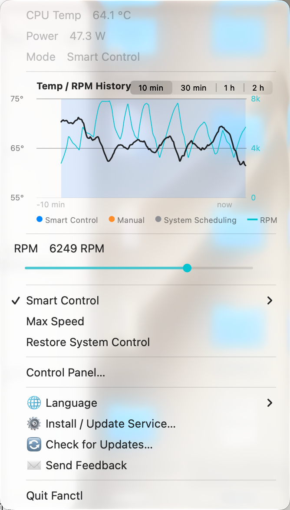

# Fanctl — Smart Fan Control for Apple Silicon Macs

**[中文文档 / Chinese README](README.zh-CN.md)**

[](LICENSE)
[](https://github.com/TomEageer/fanctl/releases/latest/download/Fanctl.zip)
[](https://github.com/TomEageer/fanctl/releases)
[](#footprint)
[](#privacy)
[](#footprint)

Open-source fan speed control for Apple Silicon MacBooks (M1 / M2 / M3 / M4 / M4 Pro / M4 Max). Keeps your Mac cool and quiet with a self-learning thermal controller — a free alternative to Macs Fan Control and TG Pro.



macOS's default fan curve is tuned for silence: fans barely spin until the chip approaches 90 °C, so the chassis runs warm all day. Fanctl gives the thermal target back to you — by default it holds the CPU die around **55 °C** on AC power (configurable per profile), with fans that ramp gently instead of howling.

## Features

- **Power feedforward** — whole-system power draw (≈ heat output) maps directly to a baseline RPM, so fans react to load *before* temperature rises
- **Self-learning thermal model** — the controller continuously learns your machine's power→RPM→cooling relationship at steady state and persists it; prediction gets better the longer it runs
- **Power-spike preemption** — a fast/slow power EMA crossover bumps fan speed the moment load jumps (e.g. a build starts), not seconds later
- **PI feedback with anti-windup** — converges on the exact equilibrium RPM, and glides back down as soon as temperature falls (no fans pinned at max after the load ends)
- **Gentle slew-rate limiting** — RPM changes are rate-limited per 3 s tick, scaled by urgency and profile (e.g. balanced: 150/300/500 up, 120 down), so you never hear a sudden howl
- **Battery aware** — releases control and stops sampling on battery power; zero battery cost
- **Fail-safe by design** — graceful exits restore macOS fan control; a separate boot-time restore daemon covers SIGKILL / panic / power loss; hardware state is reconciled at every startup; targets are clamped to the fan's own probed min/max
- **Hardened** — executables live in a root-owned directory and are ownership-verified before use; status/history/command files live under a root-owned runtime dir (never `/tmp`); the command channel is a `root:admin 0770` directory plus a strict verb whitelist
- **Three profiles** — Quiet (58 °C target, hard RPM ceiling — quiet means a noise ceiling, not just a warmer target), Balanced (55 °C), Cool (48 °C); each learns its own feedforward gain
- **Menu bar app + control panel window** — temperature in the menu bar, a 2-series history chart (temperature + RPM, color-coded by control mode), a dual-dot speed control (solid dot = live RPM, ring = your manual setpoint), a power curve sharing the RPM axis (heat produced vs. heat removed), and a standalone window for people who hide their menu bar
- **Localized UI** — English, 简体中文, 日本語, 한국어, Español, Français, Deutsch, Русский (follows system language)
- **Rendering-friendly** — 15 s refresh when closed, 2 s when open, text redraws only on change (plays nice with macOS Liquid Glass)

## Install

### Download (recommended)

1. Grab `Fanctl-x.y.z.zip` from [Releases](https://github.com/TomEageer/fanctl/releases), unzip
2. Drag `Fanctl.app` into **Applications**
3. First open: **right-click → Open** (ad-hoc signed; or `xattr -dr com.apple.quarantine /Applications/Fanctl.app`)
4. Click **Install** when prompted — one admin password installs the background service; done, it runs at boot

The app bundles everything (SMC tool, control daemon, a copy of [macmon](https://github.com/vladkens/macmon)). No Homebrew or Terminal required.

### Build from source

```bash
make
sudo ./install.sh
```

Uninstall from the menu (**Uninstall Fanctl…**) or `sudo ./uninstall.sh` — fans are handed back to macOS before anything is removed.

## How it works

```
power telemetry ──feedforward──┐
                               ├─→ target RPM ──slew limit──→ SMC fan registers
temperature ──PI (anti-windup)─┘        ↑
        └── steady-state learning updates the feedforward gain (persisted)
```

- `smcfan` (C) talks to the AppleSMC fan registers (`F0Md` / `F0Tg`) — the same channel commercial fan utilities use
- `fanctld` (Python, root LaunchDaemon) runs the control loop every ~3 s; requires a working `/usr/bin/python3` (the installer checks and tells you to run `xcode-select --install` if missing)
- `Fanctl.app` (Swift, AppKit) is the menu bar UI; it only reads status files the daemon writes — UI and SMC never contend

## FAQ

**How do I control fan speed on an Apple Silicon MacBook (M1/M2/M3/M4)?**
Install Fanctl. It exposes three modes: smart control (temperature-targeted), manual fixed speed (drag the dot), and max speed. Or hand control back to macOS at any time.

**Why is my MacBook hot but the fans stay quiet?**
Apple's firmware fan curve prioritizes silence and lets the chassis run warm — fans don't spin up hard until the die nears 90 °C. That's by design, and it's exactly what Fanctl changes.

**Can it keep my Mac below 50 °C?**
Under light load, yes. Under sustained heavy load (compiling, local LLMs), physics wins: air cooling settles around 55–65 °C even at max RPM. Fanctl holds the equilibrium honestly instead of screaming at max forever.

**Does it drain battery?**
No — on battery power Fanctl releases fan control and stops sampling entirely.

**Is it safe?**
Every exit path restores system fan control first; targets are clamped to the hardware's own min/max range; the chip's built-in thermal protection always outranks any software. Don't run two fan controllers at once (Fanctl + Macs Fan Control fighting over SMC can temporarily wedge the interface).

**Macs Fan Control / TG Pro alternative?**
Fanctl is free, open-source (MIT), has no subscription, no menu-bar meters burning CPU, and adds closed-loop temperature control with a learning feedforward — not just manual sliders and static curves.

## Footprint

Lightweight by measurement, not by claim (numbers from the developer's M4 Pro):

| | |
|---|---|
| Download | **1.0 MB** (zip) |
| Installed | **2.4 MB** (app bundle, everything included) |
| Background daemon | **~9 MB** RAM, **0.2 %** CPU idle |
| Menu bar app | **38 MB** memory footprint, **~0.2 %** CPU with the menu closed |
| Source | ~2,600 lines total across C, Python and Swift |
| Third-party runtime dependencies | **none** (bundles only [macmon](https://github.com/vladkens/macmon) for sensors) |

The UI is deliberately written to avoid repainting when nothing changed — assigning
identical text to a menu item still forces macOS to re-blur the whole translucent
backdrop, which is exactly how fan/temperature utilities end up burning CPU.

## Privacy

- **No telemetry, no analytics, no accounts, no data collection of any kind.**
- The only network access is an update check against the GitHub Releases API,
  plus the download itself if you choose to update.
- Everything runs locally; the daemon writes only to `/usr/local/var/fanctl`
  and `/var/log/fanctl.log`.
- Fully open source (MIT) — the privileged daemon is ~700 lines of readable
  Python and the SMC tool is ~200 lines of C, both auditable in a single sitting.

## Support

If Fanctl helps, see [DONATE.md](DONATE.md) — Alipay / WeChat / crypto. Everything stays free regardless.

## Changelog

Grouped by major version in [CHANGELOG.md](CHANGELOG.md); per-release notes on the [Releases page](https://github.com/TomEageer/fanctl/releases).

## Requirements

- Apple Silicon Mac, macOS 13+ (developed and tested on M4 Pro)
- Building from source needs Xcode Command Line Tools

## Keywords

Mac fan control · Apple Silicon fan speed · M1 M2 M3 M4 fan control · macOS fan curve · MacBook overheating fix · SMC fan · menu bar temperature monitor · Macs Fan Control alternative · TG Pro alternative · smcFanControl Apple Silicon

## Contact

Feedback / bug reports: [tomeageer@gmail.com](mailto:tomeageer@gmail.com) · [tomeageer.com](https://tomeageer.com) · [GitHub Issues](https://github.com/TomEageer/fanctl/issues)

## License

MIT — see [LICENSE](LICENSE). Bundles [macmon](https://github.com/vladkens/macmon) (MIT) for sensor reading.
