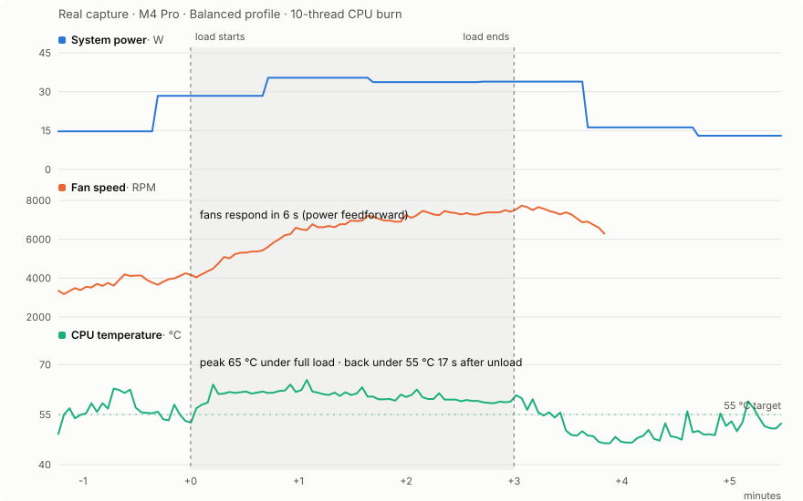
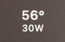

<div align="center">


# Fanctl

**Smart, self-learning fan control for Apple Silicon Macs**

Your MacBook feels warm all day because Apple tunes the fans for silence —<br>
they barely spin until the chip nears **90 °C**. Fanctl hands the thermal target back to you:<br>
pick **48 / 55 / 58 °C**, and a learning controller holds it. Quietly.

[](LICENSE)
[](https://github.com/TomEageer/fanctl/releases/latest)
[](https://github.com/TomEageer/fanctl/releases/latest/download/Fanctl.zip)
[](#footprint)
[](https://github.com/TomEageer/fanctl/releases)
[](#privacy)
[](#requirements)

[**⬇ Download**](https://github.com/TomEageer/fanctl/releases/latest/download/Fanctl.zip) · [Quick start](#quick-start) · [How it works](#how-it-works) · [FAQ](#faq) · [**中文文档**](README.zh-CN.md)


</div>

---

## Why Fanctl

Fan utilities have existed for years. They give you a slider, or a static "at X degrees spin Y" curve — and you become the controller, nudging speeds all day. Fanctl closes the loop instead:

- 🔮 **Reacts before heat arrives** — whole-system power draw ≈ heat output, so a power spike (a build starts, an LLM loads) raises fan speed *immediately*, not after the die warms up
- 🧠 **Learns your machine** — the power→RPM→cooling relationship is measured at steady state, persisted, and keeps improving the longer it runs; two Macs end up with two different controllers
- 🌊 **Glides, never howls** — PI feedback converges on the exact equilibrium RPM and slew-rate limiting caps every change, so speed transitions stay below the ear's radar
- 🍃 **Steps aside on battery** — releases control and stops sampling entirely; zero battery cost
- 🆓 **Free and open source** — MIT, no Pro tier, no subscription, ~2,600 lines you can audit in one sitting

Here is what that looks like on real data — a 3-minute 10-thread CPU burn, captured straight from the daemon's own 3-second telemetry:

<picture>
  <source media="(prefers-color-scheme: dark)" srcset="docs/images/load-response-en-dark.svg">
  
</picture>

Power steps up → fans respond in **6 s** (before the die warms) → temperature holds under full load → back below the 55 °C target **17 s** after the load ends → fans glide down and control is handed back to the system (the RPM line honestly ends where that happens).

|  | Fanctl | Macs Fan Control | TG Pro |
|---|---|---|---|
| Price | **Free (MIT)** | Free basic · paid Pro | Paid |
| Source | **Open** | Closed | Closed |
| Control model | **Closed-loop PI + learning power feedforward** | Manual + sensor curves | Manual + rules |
| Reacts before temperature rises | **Yes — power feedforward** | No | No |

## Quick start

1. **[Download Fanctl.zip](https://github.com/TomEageer/fanctl/releases/latest/download/Fanctl.zip)** and unzip
2. Drag `Fanctl.app` into **Applications**, then **right-click → Open** (ad-hoc signed)
3. Click **Install** when prompted — one admin password sets up the background service, it runs at boot from then on
4. Pick a profile: **Quiet** (58 °C, hard RPM ceiling), **Balanced** (55 °C), or **Cool** (48 °C)

Everything is bundled — SMC tool, control daemon, [macmon](https://github.com/vladkens/macmon) for sensors. No Homebrew, no Terminal.

<details>
<summary><b>Build from source</b></summary>

```bash
git clone https://github.com/TomEageer/fanctl.git && cd fanctl
make
sudo ./install.sh
```

Uninstall from the menu (**Uninstall Fanctl…**) or `sudo ./uninstall.sh` — fans are handed back to macOS before anything is removed.

</details>

## How it works

```
power telemetry ──feedforward──┐
                               ├─→ target RPM ──slew limit──→ SMC fan registers
temperature ──PI (anti-windup)─┘        ↑
        └── steady-state learning updates the feedforward gain (persisted)
```

Three small programs, each doing one job:

| Component | Language | Role |
|---|---|---|
| `smcfan` | C, ~200 lines | Talks to the AppleSMC fan registers (`F0Md`/`F0Tg`) — the same channel commercial utilities use |
| `fanctld` | Python, ~700 lines | Root LaunchDaemon running the control loop every ~3 s |
| `Fanctl.app` | Swift | Menu bar UI — only reads status files the daemon writes; UI and SMC never contend |

**Safety is structural, not aspirational:** every exit path restores macOS fan control first; a separate boot-time restore daemon covers SIGKILL / kernel panic / power loss; targets are clamped to the fan's own probed min/max; and the chip's built-in thermal protection always outranks any software. Executables live in a root-owned, ownership-verified directory; the command channel is a strict verb whitelist — never `/tmp`.

## The app

- 📊 **History chart** — temperature + RPM series color-coded by control mode, plus a power curve on the same axis: heat produced vs. heat removed
- 🎛 **Dual-dot speed control** — solid dot shows live RPM, ring shows your manual setpoint
- 🌡 **Menu bar temperature & power at a glance**  — °C/°F follows the system preference, manual override available
- 🗣 **8 languages** — English, 简体中文, 日本語, 한국어, Español, Français, Deutsch, Русский
- 🪟 **Standalone panel window** — for people who hide their menu bar
- 🧊 **Rendering-friendly** — text redraws only on change; identical text still dirties a menu item and forces macOS to re-blur the whole translucent backdrop, which is exactly how fan utilities end up burning CPU. Fanctl doesn't.

## Footprint

Lightweight by measurement, not by claim (numbers from the developer's M4 Pro):

| | |
|---|---|
| Download | **1.0 MB** zip |
| Installed | **2.4 MB** — app bundle, everything included |
| Background daemon | **~9 MB** RAM · **0.2 %** CPU idle |
| Menu bar app | **38 MB** · **~0.2 %** CPU with menu closed |
| Runtime dependencies | **none** |

## Privacy

**No telemetry. No analytics. No accounts.** The only network access is an update check against the GitHub Releases API (plus the download if you accept). Everything runs locally; the daemon writes only to `/usr/local/var/fanctl` and `/var/log/fanctl.log`.

## FAQ

<details>
<summary><b>My MacBook is hot but the fans stay quiet — is something broken?</b></summary>

No — that's Apple's design. The firmware curve prioritizes silence and lets the chassis run warm; fans don't spin up hard until the die nears 90 °C. It's exactly the behavior Fanctl changes.

</details>

<details>
<summary><b>Can it keep my Mac below 50 °C?</b></summary>

Under light load, yes. Under sustained heavy load (compiling, local LLMs), physics wins: air cooling settles around 55–65 °C even at max RPM. Fanctl holds the honest equilibrium instead of screaming at max forever.

</details>

<details>
<summary><b>Does it drain battery?</b></summary>

No — on battery power Fanctl releases fan control and stops sampling entirely.

</details>

<details>
<summary><b>Is it safe?</b></summary>

Every exit path hands the fans back to macOS first, targets are clamped to hardware limits, and the chip's built-in thermal protection always wins over any software. One rule: don't run two fan controllers at once — Fanctl and e.g. Macs Fan Control fighting over the SMC can temporarily wedge the fan interface (the SMC enters a protective state that rejects writes for a minute or two).

</details>

<details>
<summary><b>Why does it need an admin password once?</b></summary>

Writing SMC fan registers requires root. The privileged part is a ~700-line Python daemon plus a ~200-line C tool — small enough to read before you trust it.

</details>

## Requirements

- Apple Silicon Mac (M1 → M4 family), macOS 13+
- Developed and tested on M4 Pro; building from source needs Xcode Command Line Tools

## Support

If Fanctl helps, see [DONATE.md](DONATE.md) — Alipay / WeChat / crypto. Everything stays free regardless.

## Changelog

Grouped by major version in [CHANGELOG.md](CHANGELOG.md); per-release notes on the [Releases page](https://github.com/TomEageer/fanctl/releases).

## Contact

[GitHub Issues](https://github.com/TomEageer/fanctl/issues) · [tomeageer@gmail.com](mailto:tomeageer@gmail.com) · [tomeageer.com](https://tomeageer.com)

## License

MIT — see [LICENSE](LICENSE). Bundles [macmon](https://github.com/vladkens/macmon) (MIT) for sensor reading.

<sub>Mac fan control · Apple Silicon fan speed · M1 M2 M3 M4 fan control · macOS fan curve · MacBook overheating fix · SMC fan · menu bar temperature monitor · Macs Fan Control alternative · TG Pro alternative · smcFanControl Apple Silicon</sub>
