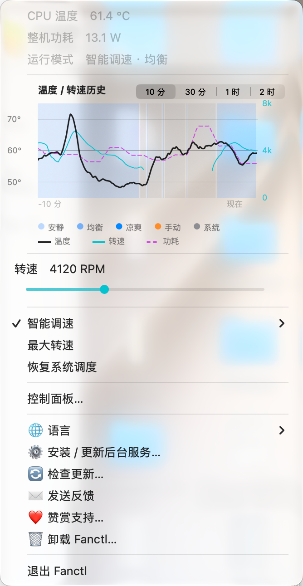
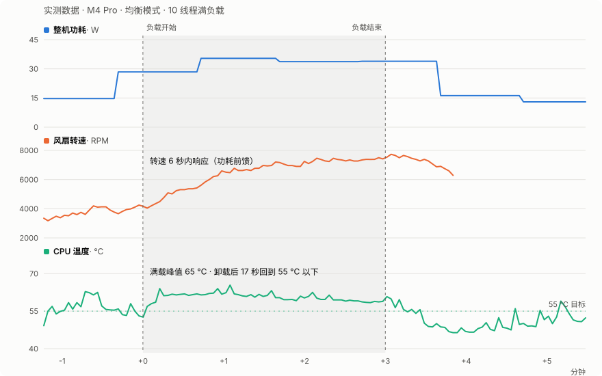

<div align="center">


# Fanctl

**Apple Silicon Mac 的智能自学习风扇控制**

你的 MacBook 整天温温的，是因为苹果把风扇调校成了"静音优先"——<br>
芯片不到 **90 °C** 风扇几乎不转。Fanctl 把温度目标还给你：<br>
选定 **48 / 55 / 58 °C**，自学习控制器安静地帮你守住。

[](LICENSE)
[](https://github.com/TomEageer/fanctl/releases/latest)
[](https://github.com/TomEageer/fanctl/releases/latest/download/Fanctl.zip)
[](#资源占用)
[](https://github.com/TomEageer/fanctl/releases)
[](#隐私)
[](#系统要求)

[**⬇ 立即下载**](https://github.com/TomEageer/fanctl/releases/latest/download/Fanctl.zip) · [快速上手](#快速上手) · [工作原理](#工作原理) · [常见问题](#常见问题) · [**English**](README.md)



</div>

---

## 为什么是 Fanctl

风扇工具存在很多年了，它们给你一根滑杆、或一条"到 X 度转 Y 速"的静态曲线——然后**你**成了那个控制器，整天手动调。Fanctl 把回路闭上：

- 🔮 **热量还没到，风扇先动** — 整机功耗 ≈ 发热量，功耗一跳（开始编译、加载本地大模型）转速立刻跟上，而不是等芯片热了才反应
- 🧠 **越用越懂你这台机器** — 在稳态下实测"功耗→转速→散热"关系并持久化，跑得越久预测越准；两台 Mac 会学出两个不同的控制器
- 🌊 **滑行，不嚎叫** — PI 反馈收敛到刚好的平衡转速，变速限幅让每次调整都在耳朵的雷达之下
- 🍃 **用电池时主动让位** — 释放控制并完全停止采样，零电池开销
- 🆓 **免费开源** — MIT 协议，没有 Pro 版、没有订阅，全部约 2,600 行代码一次就能读完

用真实数据看效果——3 分钟 10 线程满负载，直接取自 daemon 自己的 3 秒粒度遥测：

<picture>
  <source media="(prefers-color-scheme: dark)" srcset="docs/images/load-response-zh-dark.svg">
  
</picture>

功耗一跳 → 风扇 **6 秒**响应（芯片还没热）→ 满载全程温度可控 → 卸载 **17 秒**回到 55 °C 目标以下 → 转速滑落、控制交还系统（转速线在交还处如实断开）。

|  | Fanctl | Macs Fan Control | TG Pro |
|---|---|---|---|
| 价格 | **免费（MIT）** | 基础免费 · Pro 收费 | 收费 |
| 源码 | **开源** | 闭源 | 闭源 |
| 控制模型 | **闭环 PI + 自学习功耗前馈** | 手动 + 传感器曲线 | 手动 + 规则 |
| 温度升高前就响应 | **是——功耗前馈** | 否 | 否 |

## 快速上手

1. **[下载 Fanctl.zip](https://github.com/TomEageer/fanctl/releases/latest/download/Fanctl.zip)** 并解压
2. 把 `Fanctl.app` 拖进 **应用程序**，首次 **右键 → 打开**（ad-hoc 签名）
3. 按提示点 **安装** — 输一次管理员密码装好后台服务，之后开机自启
4. 选一个模式：**安静**（58 °C，带转速硬上限）、**均衡**（55 °C）、**凉爽**（48 °C）

所有组件都在包里——SMC 工具、控制守护进程、传感器读取用的 [macmon](https://github.com/vladkens/macmon)。不需要 Homebrew，不需要终端。

<details>
<summary><b>从源码构建</b></summary>

```bash
git clone https://github.com/TomEageer/fanctl.git && cd fanctl
make
sudo ./install.sh
```

卸载走菜单（**卸载 Fanctl…**）或 `sudo ./uninstall.sh` — 删除任何东西之前都会先把风扇交还给 macOS。

</details>

## 工作原理

```
功耗遥测 ────前馈──────┐
                      ├─→ 目标转速 ──变速限幅──→ SMC 风扇寄存器
温度 ──PI（抗积分饱和）─┘        ↑
        └── 稳态学习持续更新前馈增益（持久化）
```

三个小程序，各司其职：

| 组件 | 语言 | 职责 |
|---|---|---|
| `smcfan` | C，约 200 行 | 读写 AppleSMC 风扇寄存器（`F0Md`/`F0Tg`）——与商业风扇工具同一条通道 |
| `fanctld` | Python，约 700 行 | root LaunchDaemon，约 3 秒一轮控制循环 |
| `Fanctl.app` | Swift | 菜单栏界面——只读 daemon 写出的状态文件，UI 与 SMC 永不抢锁 |

**安全是结构性的，不是口号**：每条退出路径都先恢复系统风扇控制；独立的开机恢复守护覆盖 SIGKILL / 内核崩溃 / 断电；目标转速永远钳制在风扇自身探测的上下限内；芯片内建的过热保护始终高于任何软件。可执行文件放在 root 所有、启动前校验属主的目录里；命令通道是严格动词白名单——从不碰 `/tmp`。

## 应用本体

- 📊 **历史图表** — 温度 + 转速双曲线按控制模式着色，同轴叠加功耗曲线：产热量 vs 散热量
- 🎛 **双点调速控件** — 实心点是实时转速，圆环是你的手动设定值
- 🌡 **菜单栏温度** — 摄氏/华氏跟随系统偏好，可手动覆盖
- 🗣 **8 种语言** — 简体中文、English、日本語、한국어、Español、Français、Deutsch、Русский
- 🪟 **独立控制面板窗口** — 给隐藏菜单栏的人用
- 🧊 **渲染友好** — 文本不变不重绘；给菜单项赋相同文本仍会标脏、逼 macOS 重算整块毛玻璃背景——风扇类工具烧 CPU 多半烧在这里，Fanctl 不会

## 资源占用

轻量靠实测，不靠嘴（数据来自开发者的 M4 Pro）：

| | |
|---|---|
| 下载 | **1.0 MB** zip |
| 安装后 | **2.4 MB** — App 包含全部组件 |
| 后台守护 | **约 9 MB** 内存 · 空闲 **0.2%** CPU |
| 菜单栏 App | **38 MB** · 菜单关闭时 **约 0.2%** CPU |
| 运行时第三方依赖 | **无** |

## 隐私

**无遥测、无统计、无账号。** 唯一的网络访问是向 GitHub Releases API 查询更新（以及你同意后的下载本身）。一切都在本地运行；daemon 只写 `/usr/local/var/fanctl` 和 `/var/log/fanctl.log`。

## 常见问题

<details>
<summary><b>MacBook 很烫但风扇没声音，是坏了吗？</b></summary>

没坏——那是苹果的设计。固件曲线静音优先，允许机身长期温热；芯片不接近 90 °C 风扇不会大转。这正是 Fanctl 要改变的行为。

</details>

<details>
<summary><b>能把 Mac 一直压在 50 °C 以下吗？</b></summary>

轻负载可以。持续重负载（编译、本地大模型）下物理规律说了算：风冷即使满转也会稳定在 55–65 °C。Fanctl 诚实地守住平衡点，而不是永远满转嘶吼。

</details>

<details>
<summary><b>费电池吗？</b></summary>

不费——用电池时 Fanctl 释放风扇控制并完全停止采样。

</details>

<details>
<summary><b>安全吗？</b></summary>

每条退出路径都先把风扇交还 macOS，目标转速钳制在硬件上下限内，芯片内建过热保护永远压过任何软件。只有一条规矩：别同时跑两个风扇控制器——Fanctl 和 Macs Fan Control 之类抢写 SMC 会把风扇接口顶进保护态（拒绝写入一两分钟）。

</details>

<details>
<summary><b>为什么要输一次管理员密码？</b></summary>

写 SMC 风扇寄存器需要 root。特权部分是约 700 行 Python 守护 + 约 200 行 C 工具——小到可以在信任它之前先读完。

</details>

## 系统要求

- Apple Silicon Mac（M1 → M4 全系），macOS 13+
- 在 M4 Pro 上开发与测试；从源码构建需要 Xcode Command Line Tools

## 赞赏

如果 Fanctl 帮到了你，见 [DONATE.md](DONATE.md) — 支付宝 / 微信 / 加密货币。无论是否赞赏，所有功能永久免费。

## 更新日志

按大版本归纳在 [CHANGELOG.md](CHANGELOG.md)；单版详情见 [Releases 页面](https://github.com/TomEageer/fanctl/releases)。

## 联系

[GitHub Issues](https://github.com/TomEageer/fanctl/issues) · [tomeageer@gmail.com](mailto:tomeageer@gmail.com) · [tomeageer.com](https://tomeageer.com)

## 许可证

MIT — 见 [LICENSE](LICENSE)。捆绑 [macmon](https://github.com/vladkens/macmon)（MIT）用于传感器读取。

<sub>Mac 风扇控制 · Apple Silicon 风扇转速 · M1 M2 M3 M4 风扇控制 · macOS 风扇曲线 · MacBook 过热 · SMC 风扇 · 菜单栏温度监控 · Macs Fan Control 替代 · TG Pro 替代</sub>
